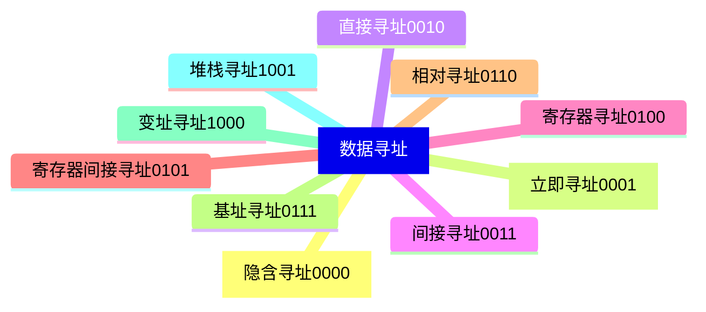

## 指令寻址

### 顺序寻址

正常情况：$(PC)+1\rightarrow PC$

问题1：主存按字节编址


问题2：变长指令字


从操作码中获取指令信息，每次加$n$


### 跳跃寻址

转移类指令自己给出


## 数据寻址

用于确定本条指令的地址码指定的真实地址

寻址方式：



指令内容：


### 直接寻址

> 假设指令字长=机器字长=存储字长，操作数=3


LDA指令会将A对应的主存位置上读数据，写入到ACC中，发生两次访存

问题：

1. A的位数有限
2. 操作数地址不易修改

### 间接寻址


A保存地址，地址指向EA。三次访存。


两次间接寻址：

A保存地址A1,A1保存A2,A2指向EA。四次访存。

类比：函数的多层调用


### 寄存器寻址

地址码指向某个寄存器


执行访存一次，但价格昂贵


### 寄存器间接寻址

寄存器存指针，仿寄存器后再访存


### 隐含寻址

一个操作数在主存，另一个在寄存器默认在ACC


### 立即寻址


数据直接就在指令中，但是容量有限


### 偏移寻址-基址寻址
以程序的起始位置为起点

$$
EA = (BR) + A
$$

CPU内部有`BR`寄存器表示程序起始位置，或者采用通用寄存器代替基址寄存器，需要在指令中`R0`指明将那个作为基址寄存器


优点：多道程序并发。


### 偏移寻址-变址寻址

程序员自己决定起点

$$
EA = (IX) + A
$$


几乎和基址寻址相同，但程序员可操作（基址寻址只能有OS控制）

作用：

```cpp
for(int i=0;i<n;i++){
    sum += a[i]; // 将a地址放入IX，OP(sum, ix, i)
}
```


### 偏移寻址-基址+变址

操作系统+用户

用户程序在操作系统中并行时，上面的代码需要加上基址，即$(ACC) + (*a + (IX)) \rightarrow ACC$
$$
EA = (IX) + ((BR)+A)
$$


### 偏移寻址-相对寻址

PC下一条指向地址作为起点（PC每次加一个指令字长）

$$
EA = (PC + ^"1^") + A
$$


案例：

```cpp
for(int i=0;i<n;i++){
    sum += a[i];
}
```

优点：

1. 代码模块化：相当于转移指令
2. 可移植性：使用相对寻址可以使程序在不同的内存布局和地址分配方案下仍然能够正确地访问数据。程序的源代码中使用的是相对偏移量，而不是具体的物理地址。因此，当程序加载到不同的内存位置时，只需调整基址（起始地址）即可，而无需修改程序的指令或数据。
3. 内存动态分配：相对寻址允许操作系统在运行时动态地分配和释放内存块。OS可以根据需要将不同的程序和数据加载到内存的不同位置，然后通过调整基址来实现相对寻址。这使得内存的使用更加高效和灵活。
4. 安全性：使随机地址，避免恶意攻击


### 堆栈寻址

操作数在堆栈中，使用栈顶指针SP作为操作数地址


硬堆栈：栈保存在寄存器中

软堆栈：栈保存在主存中。


