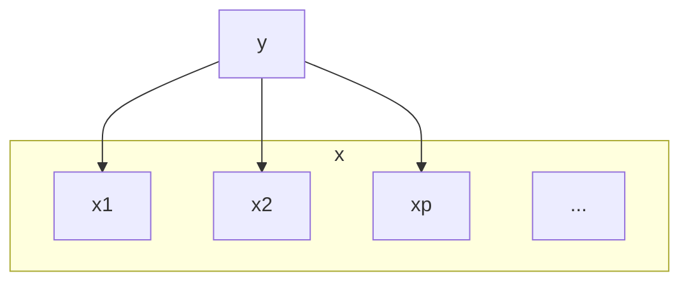

---
aliases:
  - Naive Bayes
tags:
  - ai
  - 概率论
---
## 朴素贝叶斯

**朴素贝叶斯假设**/条件独立性假设、最简单的概率图模型

其中xi表示的是维度而不是变量，其中$x_i\perp x_j|y,\forall\  i\ne j$

那么朴素贝叶斯算法假设：
$$
P(x_1, x2|y) = p(x_1|y) p(x_2|y)
$$

也就是说
$$
p(x|y)=\prod\limits_{i=1}^pp(x_i|y)
$$
这里起了简化运算的作用，没有其它动机。

回顾一下概率生成模型
$$
\begin{align}
\hat{y} &= \mathop{argmax}_{y\in\{0,1\}}\ p(y|x) \\&= \mathop{argmax}_{y}\ \frac{p(x,y)}{p(x)} \\
&= \mathop{argmax}_{y}\ p(y)p(x|y)
\end{align}
$$

利用贝叶斯定理，对于单次观测：
$$
p(y|x)=\frac{p(x|y)p(y)}{p(x)}=\frac{\prod\limits_{i=1}^pp(x_i|y)p(y)}{p(x)}
$$
对于单个维度的条件概率以及类先验作出进一步的假设：

1.  $x_i$ 为连续变量：$p(x_i|y)=\mathcal{N}(\mu_i,\sigma_i^2)$
2.  $x_i$ 为离散变量：类别分布（Categorical）：$p(x_i=i|y)=\theta_i,\sum\limits_{i=1}^K\theta_i=1$
3.  $p(y)=\phi^y(1-\phi)^{1-y}$

对这些参数的估计，常用 MLE 的方法直接在数据集上估计，由于不需要知道各个维度之间的关系，因此，所需数据量大大减少了。估算完这些参数，再代入贝叶斯定理中得到类别的后验分布。

- [一文详解朴素贝叶斯(Naive Bayes)原理 - 知乎](https://zhuanlan.zhihu.com/p/37575364)