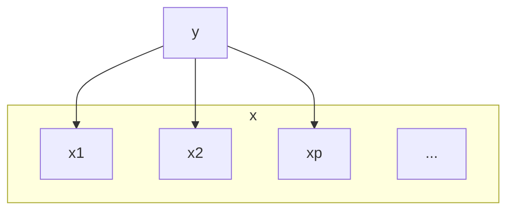

---
aliases:
  - 线性分类
  - LinearClassification
tags:
  - ai
  - ML/线性模型
---

# 线性分类

## 背景

#### 过渡

线性回归是怎么过渡到线性分类的？

打破线性回归的全局非线性。

这里我们定义分类函数
$$
y = f(w^Tx+b) \quad y\in\{0,1\}\ or\ y\in[0,1]
$$
这里我们将$f$称作[激活函数](../激活函数.md)，$f^{-1}$称为链接函数：
$$
\begin{align}
f&: w^Tx+b \longrightarrow \{0,1\} \\
f^{-1}&:\{0,1\} \longrightarrow w^Tx+b
\end{align}
$$

### 分类的类别

对于分类任务，线性回归模型就无能为力了，但是我们可以在线性模型的函数进行后再加入一层[激活函数](../激活函数.md)，这个函数是非线性的，[激活函数](../激活函数.md)的反函数叫做链接函数。我们有两种线性分类的方式：

1.  硬分类，我们直接需要输出观测对应的分类，即$y\in\{0,1\}$。这类模型的代表为：
    1.  线性判别分析（Fisher 判别）
    2.  感知机
2.  软分类，产生不同类别的概率，即$y\in[0,1]$，这类算法根据概率方法的不同分为两种
    1.  生成式（根据贝叶斯定理先计算参数后验，再进行推断）：高斯判别分析（GDA）和朴素贝叶斯等为代表
        1.  GDA
        2.  Naive Bayes
    2.  判别式（直接对条件概率进行建模）：Logistic 回归

## 感知机

想法：错误驱动。

假定

- 模型：$f(x) = sign(x) \quad x,w \in \mathbb{R}^P$
- [激活函数](../激活函数.md)：$sign(a)=\left\{\begin{matrix}+1,a\ge0\\-1,a\lt0\end{matrix}\right.$ 
- 被错误分类的样本：集合$\mathcal{D}$

错误分类就是给$w$一个初始值，不断的挪动我们的曲线，使得$\mathcal{D}$中元素最少。

这里的损失函数为：$L(w)=\sum\limits_{x_i\in\mathcal{D}} I(y_iw^Tx_i)$,其中$I=\left\{\begin{matrix}+1,a>0\\0,a=0\\-1,a\lt0\end{matrix}\right.$ 

虽然很直观，但是这个方法有个问题，它的函数

1. 不连续、不可导，不能求解
2. 是NP Hard问题

我们继续观察$z = y_iw^Tx$，当$w$变动一点点，$z$也会变化一点点，这样就可导了，为何不将其当作一个损失函数呢？

现在构造新损失函数$L(w)$：
$$
L(w)=\sum\limits_{x_i\in\mathcal{D}_{wrong}}-y_iw^Tx_i
$$
计算时，我们采用随机梯度下降(SGD)算法

如果不是线性可分的，我们有pocket algorithm，它允许有一点点错误存在

- [ ] 感知机收敛定理 #todo
- [ ] pocket algorithm #todo

## 线性判别分析
也叫Fisher判别分析。[罗纳德·费希尔\_百度百科](https://baike.baidu.com/item/%E7%BD%97%E7%BA%B3%E5%BE%B7%C2%B7%E8%B4%B9%E5%B8%8C%E5%B0%94/58187642)

思想是：**类内小，类间大**。

从**降维**的角度出发，把数据全部**投影**到一维的坐标轴上，之后选定一个**阈值**来分类。

现在需要找一个最合适的**投影方向**，比如说上图中右边的更好。

这里指的就是**最大化类间间隔，最小化类内方差**。用计算机行话就是**“高内聚低耦合”**。

### 模型定义

首先是投影，我们假定原来的数据是向量 $x$，那么顺着 $ w$ 的**方向投影**就是标量$z$：
$$
z=w^T\cdot x(=|w|\cdot|x|\cos\theta)
$$
投影的**均值**$\bar{z}$：
$$
\bar{z}= \frac{1}{N}w^T\cdot x
$$

投影的**方差**$S_z$：
$$
\begin{align}
S_z &=\frac{1}{N}\sum\limits_{i=1}^{N_2}(z_i-\bar{z})(z_i-\bar{z})^T\nonumber\\
&=\frac{1}{N}\sum\limits_{i=1}^{N_2}(w^Tx_i-\bar{z})(w^Tx_i-\bar{z})^T\nonumber
\end{align}
$$
假设属于两类的试验样本数量分别是 $N_1$和 $N_2$，那么我们采用方差矩阵来表征每一个类内的总体分布，这里我们使用了协方差的定义，用 $S$ 表示原数据的协方差：
$$
\begin{align}
C_1:Var_z[C_1]&=\frac{1}{N_1}\sum\limits_{i=1}^{N_1}(z_i-\overline{z_{c1}})(z_i-\overline{z_{c1}})^T\nonumber\\
&=\frac{1}{N_1}\sum\limits_{i=1}^{N_1}(w^Tx_i-\frac{1}{N_1}\sum\limits_{j=1}^{N_1}w^Tx_j)(w^Tx_i-\frac{1}{N_1}\sum\limits_{j=1}^{N_1}w^Tx_j)^T\nonumber\\
&=w^T\frac{1}{N_1}\sum\limits_{i=1}^{N_1}(x_i-\overline{x_{c1}})(x_i-\overline{x_{c1}})^Tw\nonumber\\
&=w^TS_1w
\end{align}
$$

$$
\begin{align}
C_2:Var_z[C_2]&=\frac{1}{N_2}\sum\limits_{i=1}^{N_2}(z_i-\overline{z_{c2}})(z_i-\overline{z_{c2}})^T\nonumber\\
&=w^TS_2w
\end{align}
$$

所以**类内**距离可以记为**方差的和**：
$$
\begin{align}
Var_z[C_1]+Var_z[C_2]=w^T(S_1+S_2)w
\end{align}
$$
对于**类间**距离，我们可以用两类的**均值**表示这个距离：
$$
\begin{align}
(\overline{z_{c1}}-\overline{z_{c2}})^2&=(\frac{1}{N_1}\sum\limits_{i=1}^{N_1}w^Tx_i-\frac{1}{N_2}\sum\limits_{i=1}^{N_2}w^Tx_i)^2\nonumber\\
&=(w^T(\overline{x_{c1}}-\overline{x_{c2}}))^2\nonumber\\
&=w^T(\overline{x_{c1}}-\overline{x_{c2}})(\overline{x_{c1}}-\overline{x_{c2}})^Tw
\end{align}
$$
综合这两点，由于协方差是一个矩阵，于是我们用将这两个值相除来得到我们的损失函数，并最大化这个值：
$$
\begin{align}
\hat{w}=\mathop{argmax}\limits_wJ(w)&=\mathop{argmax}\limits_w\frac{(\overline{z_{c1}}-\overline{z_{c2}})^2}{Var_z[C_1]+Var_z[C_2]}\nonumber\\
&=\mathop{argmax}\limits_w\frac{w^T(\overline{x_{c1}}-\overline{x_{c2}})(\overline{x_{c1}}-\overline{x_{c2}})^Tw}{w^T(S_1+S_2)w}\nonumber\\
&=\mathop{argmax}\limits_w\frac{w^TS_bw}{w^TS_ww}
\end{align}
$$

> 这里
>
> - $S_b$(Between Class)表示类间方差
>
> - $S_w$(Within Class)表示类内方差

### 模型求解

这样，我们就把损失函数和原数据集以及参数结合起来了。

下面对这个损失函数求偏导，注意我们其实对 $w$ 的绝对值没有任何要求，只对**方向**有要求，因此只要一个方程就可以求解了：
$$
\begin{align}
&\frac{\partial}{\partial w}J(w)=2S_bw(w^TS_ww)^{-1}-2w^TS_bw(w^TS_ww)^{-2}S_ww=0\nonumber\\
&\Longrightarrow S_bw(w^TS_ww)=(w^TS_bw)S_ww\nonumber\\
&\Longrightarrow w\propto S_w^{-1}S_bw=S_w^{-1}(\overline{x_{c1}}-\overline{x_{c2}})(\overline{x_{c1}}-\overline{x_{c2}})^Tw\propto S_w^{-1}(\overline{x_{c1}}-\overline{x_{c2}})
\end{align}
$$
于是 $ S_w^{-1}(\overline{x_{c1}}-\overline{x_{c2}})$ 就是我们需要寻找的方向。最后可以归一化求得单位的 $w$ 值。

## 逻辑回归

有时候我们只要得到一个类别的概率，那么我们需要一种能输出 $[0,1]$ 区间的值的函数。考虑两分类模型，我们利用判别模型，希望对 $p(C|x)$ 建模，这就是概率判别模型的工作。

逻辑回归就是采用一个特殊的[激活函数](../激活函数.md)，将线性回归问题转换为线性分类问题，这个[激活函数](../激活函数.md)叫做**[Sigmoid函数](../Sigmoid函数.md)**
$$
\left.\left\{\begin{array}{l}{{p_{i}=p(y=1\mid x)=\sigma(w^{*}x)=\frac{1}{1+e^{-w^{T}x}},y=1}}\\{{p_{0}=p(y=0\mid x)=1-p(y=1\mid x)=\frac{e^{-w^{T}x}}{1+e^{-w^{T}x}},y=0}}\\\end{array}\right.\right.
$$

利用贝叶斯定理：
$$
p(C_1|x)=\frac{p(x|C_1)p(C_1)}{p(x|C_1)p(C_1)+p(x|C_2)p(C_2)}
$$
取 $a=\ln\frac{p(x|C_1)p(C_1)}{p(x|C_2)p(C_2)}$，于是：
$$
p(C_1|x)=\frac{1}{1+\exp(-a)}
$$
上面的式子叫 Logistic [Sigmoid 函数](../Sigmoid函数.md)，其参数表示了两类联合概率比值的对数。在判别式中，不关心这个参数的具体值，模型假设直接对 $a$ 进行。

Logistic 回归的模型假设是：
$$
a=w^Tx
$$
于是，通过寻找 $  w$ 的最佳值可以得到在这个模型假设下的最佳模型。概率判别模型常用最大似然估计的方式来确定参数。

对于一次观测，获得分类 $y$ 的概率为（假定$C_1=1,C_2=0$）：
$$
p(y|x)=p_1^yp_0^{1-y}
$$

那么对于 $N$ 次独立全同的观测 MLE为：
$$
\hat{w}=\mathop{argmax}_wJ(w)=\mathop{argmax}_w\sum\limits_{i=1}^N(y_i\log p_1+(1-y_i)\log p_0)
$$
注意到，从信息论角度，这个表达式其实是**交叉熵(Cross Entropy)**表达式的相反数乘 $N$，MLE 中的对数也保证了可以和指数函数相匹配，从而在大的区间汇总获取稳定的梯度。

对这个函数求导数，注意到：
$$
p_1'=(\frac{1}{1+\exp(-a)})'=p_1(1-p_1)
$$
则：
$$
J'(w)=\sum\limits_{i=1}^Ny_i(1-p_1)x_i-p_1x_i+y_ip_1x_i=\sum\limits_{i=1}^N(y_i-p_1)x_i
$$
由于概率值的非线性，放在求和符号中时，这个式子无法直接求解。于是在实际训练的时候，和感知机类似，也可以使用不同大小的批量随机梯度上升（对于最小化就是梯度下降）来获得这个函数的极大值。

## 高斯判别分析

高斯判别分析(Gaussian Discriminate Analysis, GDA)，一种**连续**的**软输出**的**概率生成**模型。

### 概率生成模型

概率判别模型需要将$p(y|x)$的**值**求出来，但是概率生成模型只关心**更像谁**，即属于0多一点还是属于1多一点。

这里问题转化为：
$$
p(y|x) = \frac{p(x|y)\times p(y)}{p(x)} \propto p(x|y)\times p(y)
$$
$p(y)$是先验，$p(x|y)$是似然，$p(y|x)$是后验。

生成模型：
$$
\hat{y} = \mathop{argmax}_{y\in\{0,1\}} p(y|x) = \mathop{argmax}_{y}p(y)p(x|y)
$$

### 模型定义

1. 把$y$看作一个伯努利分布：$y\sim Bernoulli(\phi)$。
2. 假设似然满足高斯分布：$x|y=1\sim\mathcal{N}(\mu_1,\Sigma)$, $x|y=0\sim\mathcal{N}(\mu_0,\Sigma)$

这里定义一个log似然函数：
$$
\begin{aligned}
\log-likelihood:\quad w_0&=\log\frac N{i=1}p(x_i,y_i)\\
&=\sum_{i=1}^N\log(p(x_i | y_i)p(y_i))\\
&=\sum_{i=1}^N[\log p(x_i|y_i)+\log p(y_i)] \\
&=\sum_{i=1}^{N}\left[\log N\left(\mu_{1}\bar{z}\right)^{y_{i}}\cdot N\left(\mu_{2}\bar{z}\right)^{1-y_{i}}+\log\phi^{y_{i}}\left(-\phi\right)^{+y_{i}}\right]\\
&=\sum_{i=1}^{N}\left[\log N\left(\mu_{1}\bar{z}\right)^{y_{i}}+\log N\left(\mu_{2}\bar{z}\right)^{1-y_{i}}+\log\phi^{y_{i}}\left(-\phi\right)^{1-y_{i}}\right] \\
&=\sum_{i=1}^{N}[\underbrace{\log N(M,\Sigma)}_{1}+\underbrace{\log N(M,\Sigma)}_2+\underbrace{\log\phi^{y_{i}}(1-\phi)^{-y_{i}}}_{3}]
\end{aligned}
$$

### 模型求解-求 $\phi$

首先对  进行求解，将式子3对 $\phi$ 求偏导：
$$
\begin{align}\sum\limits_{i=1}^N\frac{y_i}{\phi}+\frac{y_i-1}{1-\phi}=0\nonumber\\
\Longrightarrow\phi=\frac{\sum\limits_{i=1}^Ny_i}{N}=\frac{N_1}{N}
\end{align}
$$

### 模型求解-求 $\mu_1$

然后利用式子1求解 $\mu_1$：
$$
\begin{align}\hat{\mu_1}&=\mathop{argmax}_{\mu_1}\sum\limits_{i=1}^Ny_i\log\mathcal{N}(\mu_1,\Sigma)\nonumber\\
&=\mathop{argmin}_{\mu_1}\sum\limits_{i=1}^Ny_i(x_i-\mu_1)^T\Sigma^{-1}(x_i-\mu_1)
\end{align}
$$
由于：
$$
\sum\limits_{i=1}^Ny_i(x_i-\mu_1)^T\Sigma^{-1}(x_i-\mu_1)=\sum\limits_{i=1}^Ny_ix_i^T\Sigma^{-1}x_i-2y_i\mu_1^T\Sigma^{-1}x_i+y_i\mu_1^T\Sigma^{-1}\mu_1
$$

求微分左边乘以 $\Sigma$ 可以得到：
$$
\begin{align}\sum\limits_{i=1}^N-2y_i\Sigma^{-1}x_i+2y_i\Sigma^{-1}\mu_1=0\nonumber\\
\Longrightarrow\mu_1=\frac{\sum\limits_{i=1}^Ny_ix_i}{\sum\limits_{i=1}^Ny_i}=\frac{\sum\limits_{i=1}^Ny_ix_i}{N_1}
\end{align}
$$

### 模型求解-求$\mu_0$

求解 $\mu_0$，由于正反例是对称的，所以：
$$
\mu_0=\frac{\sum\limits_{i=1}^N(1-y_i)x_i}{N_0}
$$

### 模型求解-求协方差 $\Sigma$

最为困难的是求解 $\Sigma$，我们的模型假设对正反例采用相同的协方差矩阵，当然从上面的求解中我们可以看到，即使采用不同的矩阵也不会影响之前的三个参数。首先我们有：
$$
\begin{align}
\sum\limits_{i=1}^N\log\mathcal{N}(\mu,\Sigma)&=\sum\limits_{i=1}^N\log(\frac{1}{(2\pi)^{p/2}|\Sigma|^{1/2}})+(-\frac{1}{2}(x_i-\mu)^T\Sigma^{-1}(x_i-\mu))\nonumber\\
&=Const-\frac{1}{2}N\log|\Sigma|-\frac{1}{2}Trace((x_i-\mu)^T\Sigma^{-1}(x_i-\mu))\nonumber\\
&=Const-\frac{1}{2}N\log|\Sigma|-\frac{1}{2}Trace((x_i-\mu)(x_i-\mu)^T\Sigma^{-1})\nonumber\\
&=Const-\frac{1}{2}N\log|\Sigma|-\frac{1}{2}NTrace(S\Sigma^{-1})
\end{align}
$$
在这个表达式中，我们在标量上加入迹从而可以交换矩阵的顺序，对于包含绝对值和迹的表达式的导数，我们有：
$$
\begin{align}
\frac{\partial}{\partial A}(|A|)&=|A|A^{-1}\\
\frac{\partial}{\partial A}Trace(AB)&=B^T
\end{align}
$$
因此：
$$
\begin{align}[\sum\limits_{i=1}^N((1-y_i)\log\mathcal{N}(\mu_0,\Sigma)+y_i\log \mathcal{N}(\mu_1,\Sigma)]'
\nonumber\\=Const-\frac{1}{2}N\log|\Sigma|-\frac{1}{2}N_1Trace(S_1\Sigma^{-1})-\frac{1}{2}N_2Trace(S_2\Sigma^{-1})
\end{align}
$$
其中，$S_1,S_2$ 分别为两个类数据内部的协方差矩阵，于是：
$$
\begin{align}N\Sigma^{-1}-N_1S_1^T\Sigma^{-2}-N_2S_2^T\Sigma^{-2}=0\nonumber
\\\Longrightarrow\Sigma=\frac{N_1S_1+N_2S_2}{N}
\end{align}
$$
这里应用了类协方差矩阵的对称性。

于是我们就利用最大后验的方法求得了我们模型假设里面的所有参数，根据模型，可以得到联合分布，也就可以得到用于推断的条件分布了。

## 朴素贝叶斯

**朴素贝叶斯假设**/条件独立性假设、最简单的概率图模型

其中xi表示的是维度而不是变量，其中$x_i\perp x_j|y,\forall\  i\ne j$

那么朴素贝叶斯假设：
$$
P(x_1, x2|y) = p(x_1|y) p(x_2|y)
$$

也就是说
$$
p(x|y)=\prod\limits_{i=1}^pp(x_i|y)
$$
这里起了简化运算的作用，没有其它动机。

回顾一下概率生成模型
$$
\begin{align}
\hat{y} &= \mathop{argmax}_{y\in\{0,1\}}\ p(y|x) \\&= \mathop{argmax}_{y}\ \frac{p(x,y)}{p(x)} \\
&= \mathop{argmax}_{y}\ p(y)p(x|y)
\end{align}
$$

利用贝叶斯定理，对于单次观测：
$$
p(y|x)=\frac{p(x|y)p(y)}{p(x)}=\frac{\prod\limits_{i=1}^pp(x_i|y)p(y)}{p(x)}
$$
对于单个维度的条件概率以及类先验作出进一步的假设：

1.  $x_i$ 为连续变量：$p(x_i|y)=\mathcal{N}(\mu_i,\sigma_i^2)$
2.  $x_i$ 为离散变量：类别分布（Categorical）：$p(x_i=i|y)=\theta_i,\sum\limits_{i=1}^K\theta_i=1$
3.  $p(y)=\phi^y(1-\phi)^{1-y}$

对这些参数的估计，常用 MLE 的方法直接在数据集上估计，由于不需要知道各个维度之间的关系，因此，所需数据量大大减少了。估算完这些参数，再代入贝叶斯定理中得到类别的后验分布。

- [一文详解朴素贝叶斯(Naive Bayes)原理 - 知乎](https://zhuanlan.zhihu.com/p/37575364)
