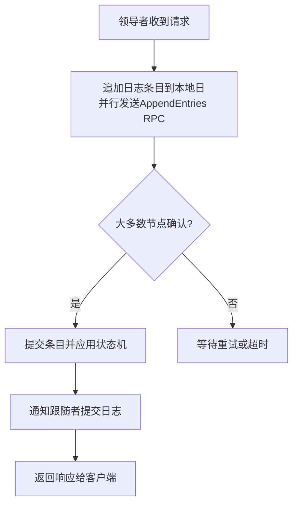
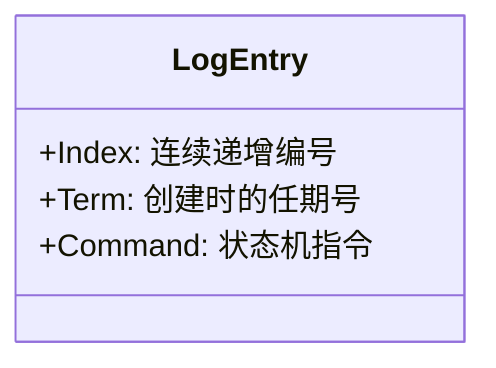
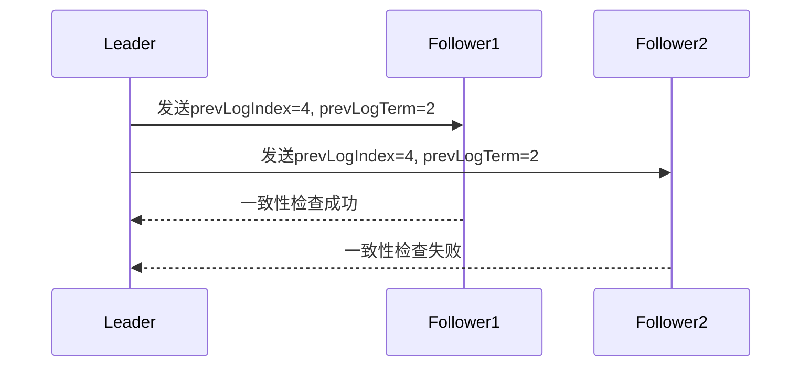
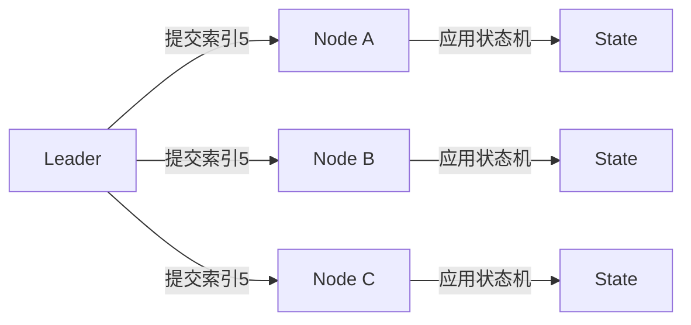
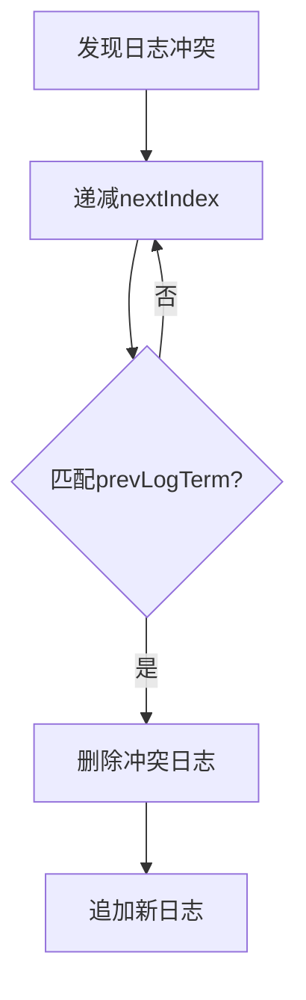

## 日志：分布式系统的记忆载体
在分布式系统中，日志（Log）是系统的核心记忆单元。Raft通过以下设计确保日志强一致性：
- **唯一连续性**：每个日志条目有全局唯一的递增索引（Index）和任期号（Term）
- **操作原子性**：所有节点最终存储相同顺序的操作序列
- **状态确定性**：日志内容决定状态机的最终状态

## 日志结构解剖


## 日志复制五部曲
### 1. 客户端请求接收
领导者将客户端请求包装为日志条目，赋予当前任期号和最新索引+1

### 2. 并行广播（AppendEntries RPC）


参数包含：
- prevLogIndex：前一个日志的索引
- prevLogTerm：前一个日志的任期号
- entries[]：新日志条目
- leaderCommit：已提交的最高索引

### 3. 跟随者一致性验证
跟随者执行关键检查：
```python
if self.log[prevLogIndex].term != prevLogTerm:
    return False  # 日志不一致
else:
    append_new_entries()  # 接受新日志
```

### 4. 日志提交（Commit）
当日志复制到大多数节点时：


### 5. 响应客户端
领导者应用日志到状态机后，将执行结果返回客户端

## 关键保障机制
### 日志匹配特性（Log Matching Property）
数学归纳法证明：
1. **初始状态**：空日志天然满足一致性
2. **归纳步骤**：若日志n的term相同，则n-1的term必然相同
3. **传递结果**：所有日志最终达成一致

### 冲突解决方案
当跟随者日志不一致时：


### 安全性屏障
1. **选举限制**：只有包含所有已提交日志的节点才能成为领导者
2. **提交规则**：只能通过当前任期日志间接提交旧日志

## 工程实践启示
1. **批量提交**：合并多个请求提升吞吐量
2. **流水线优化**：连续发送RPC无需等待响应
3. **心跳复用**：携带日志条目提高传播效率

Raft通过这种严谨的日志设计，将复杂的共识问题转化为可验证的日志操作序列，为分布式系统提供了可靠的一致性保障基础。