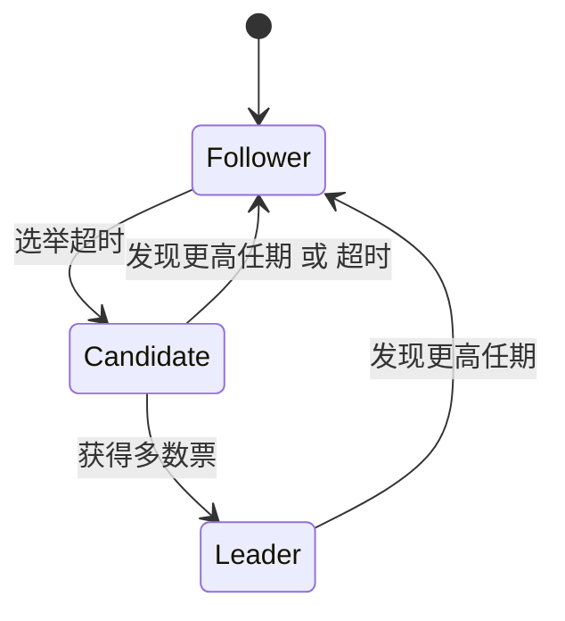
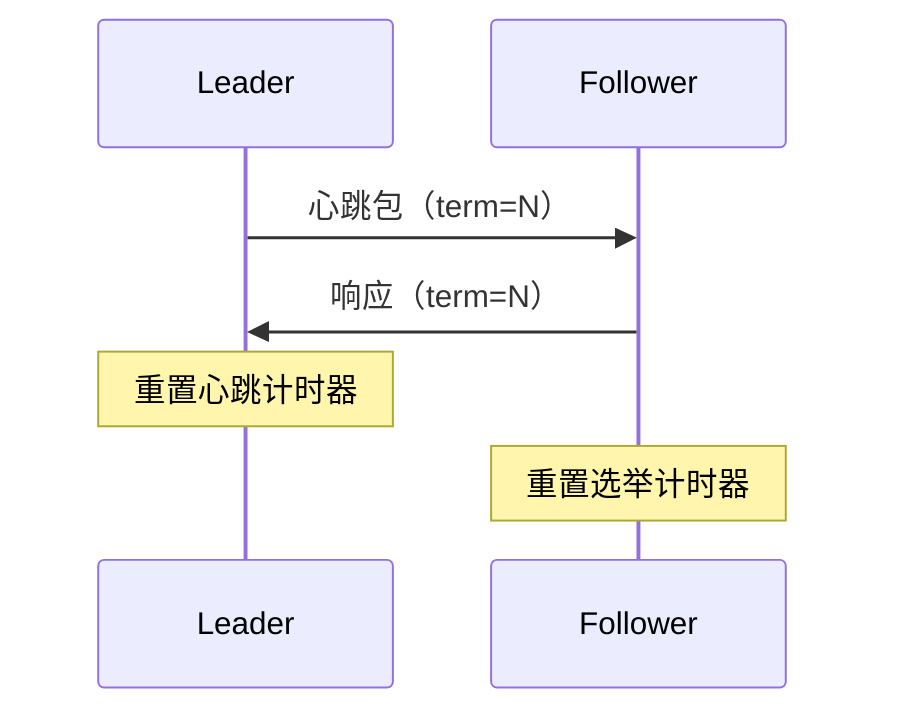
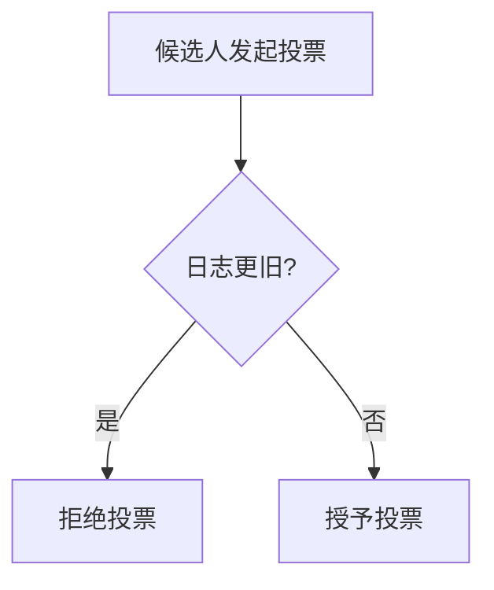

## 为什么需要领导者？

在分布式系统中，Raft通过强领导者机制简化共识过程。领导者负责管理日志复制、处理客户端请求，并持续向其他节点发送心跳包维持权威。这种设计使得Raft比Paxos更易理解与实现。

## 选举三要素

### 1. 节点状态机
- **跟随者（Follower）**：被动接收指令
- **候选者（Candidate）**：发起选举的临时状态
- **领导者（Leader）**：集群唯一有效决策者

### 2. 任期（Term）
全局单调递增的逻辑时钟，每个任期最多产生一个`Leader`。当节点发现更高任期时立即转为`Follower`。

### 3. 心跳机制

## 选举触发机制

当跟随者在**选举超时时间**（通常150-300ms随机值）内未收到心跳：

1. 自增当前任期
2. 转换为候选者状态
3. 向所有节点发送RequestVote RPC
4. 启动**选举超时计时器**

## 投票规则

候选人需要获得**超过半数节点**的选票才能当选。每个节点在同一任期内：

- 最多投出一票（先到先得）
- 只投票给日志至少和自己一样新的候选人（比较最后日志的term和index）

## 选举结果处理

- **赢得多数票**：立即成为领导者，广播心跳确立权威
- **收到更高任期**：立即转为跟随者
- **选举超时**：重启选举（随机化超时避免活锁）

## 工程实践要点

1. **随机化超时**：150-300ms范围内的随机值可有效防止多个候选人同时竞选
2. **预选举优化**：在增加任期前先发起预投票（Pre-Vote）避免网络分区导致的任期爆炸
3. **心跳广播**：领导者当选后立即发送空日志心跳，减少客户端请求等待

## 实现代码

见Commit：[lab3A: 修复了很弱智的bug · hyperv0id](https://github.com/hyperv0id/mit6.824/commit/b5e007d43e1945d8c5e6dcc4e02a663b623581b7)