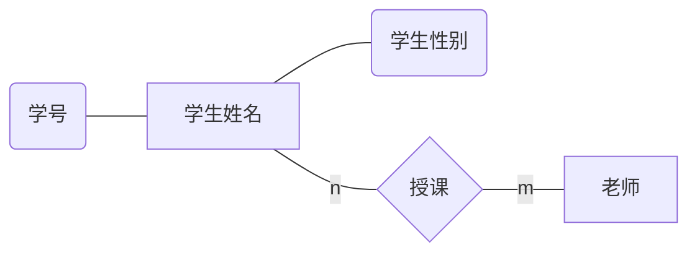
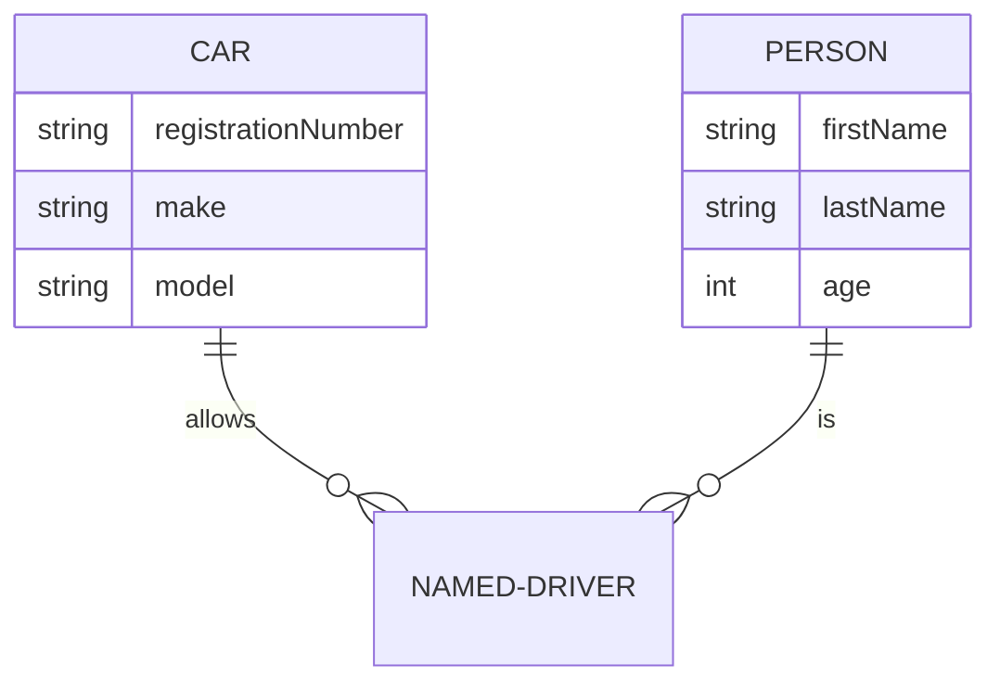

### 实体
方框表示

```mermaid
flowchart LR 
	id[实体名称]
```

### 实体属性

```mermaid
flowchart LR 
	id(实体属性)
```

### 实体之间的联系

```mermaid
flowchart LR 
	id{实体联系}
```

## Example

### 多对多关系

```mermaid
flowchart LR 
	stu_id(学号)
	stu_name[学生姓名]
	stu_gentle(学生性别)
	shouke{授课}
	teacher[老师]
	stu_id --- stu_name
	stu_name --- stu_gentle
	stu_name -- n --- shouke
	shouke -- m --- teacher
```

```mermaid
erDiagram
    CAR ||--o{ NAMED-DRIVER : allows
    CAR {
        string registrationNumber
        string make
        string model
    }
    PERSON ||--o{ NAMED-DRIVER : is
    PERSON {
        string firstName
        string lastName
        int age
    }
```
